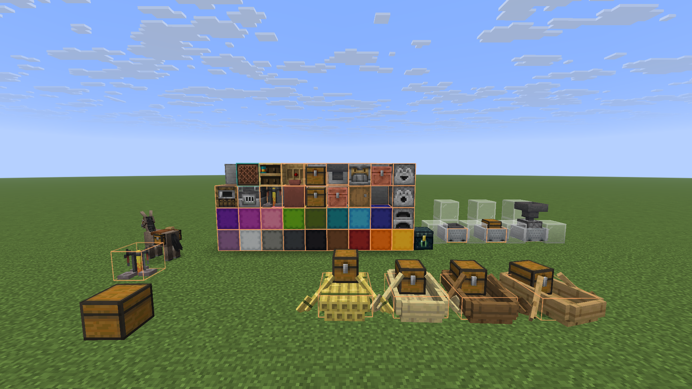
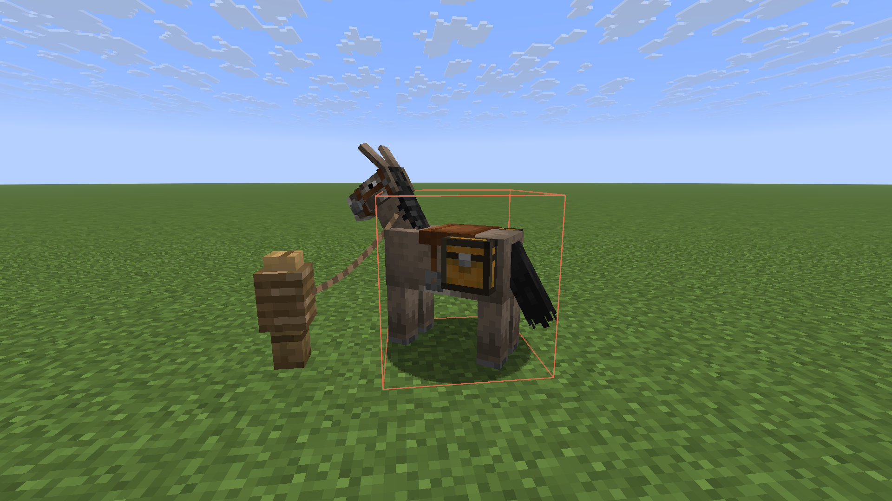

# Items Retrieval

[](https://www.minecraft.net/)
[](https://fabricmc.net/)
[](https://www.oracle.com/java/)

> 客户端物品检索辅助模组。打开检索面板后添加要查找的物品，点击执行附近检索或开启持续检索，即可查看附近命中容器并获得高亮与方向提示。

## 📋 功能特性

| 功能 | 说明 |
|------|------|
| **检索面板** | 按 `U` 键打开专属 GUI，可添加最多 128 种目标物品 |
| **附近检索** | 按 `O` 键执行单次检索，扫描范围内的容器 |
| **持续检索** | 开启后每 10 秒自动刷新，高亮持续显示 |
| **高亮渲染** | 命中的容器以彩色方框高亮（可自定义颜色） |
| **方向指引** | 最多显示 6 条方向引导线，指向最近的命中容器 |
| **结果分页** | 中央展示区支持翻页，浏览所有检索结果 |

## 🎮 游戏演示



## ⌨️ 按键说明

| 按键 | 功能 |
|------|------|
| `U` | 打开/关闭检索面板 |
| `O` | 执行单次附近检索 / 切换持续检索模式 |

## 🔧 技术栈

| 类别 | 技术 |
|------|------|
| **游戏版本** | Minecraft 1.21.10 |
| **Mod Loader** | Fabric Loader 0.18.1 |
| **Mod API** | Fabric API 0.138.4+1.21.10 |
| **编程语言** | Java 21 |
| **映射** | Yarn 1.21.10+build.3 |
| **构建工具** | Gradle + fabric-loom |
| **代码注入** | Mixin |
| **输入处理** | LWJGL / GLFW |

### 项目架构

```
src/
├── main/
│   ├── java/org/example/item_retrieval/
│   │   ├── ItemRetrievalMod.java          # 模组主入口
│   │   └── screen/SearchScreenHandler.java # GUI 句柄
│   └── resources/
│       └── fabric.mod.json                # 模组元数据
└── client/
    └── java/org/example/item_retrieval/client/
        ├── ItemRetrievalModClient.java     # 客户端入口
        ├── config/SearchRuntimeConfig.java # 运行时配置
        ├── screen/SearchScreen.java         # 检索面板 UI
        ├── search/
        │   ├── SearchScanner.java          # 容器扫描器
        │   ├── SearchTargetManager.java     # 目标管理
        │   └── SearchHighlightRenderer.java  # 高亮渲染
        ├── runtime/ContinuousSearchScheduler.java  # 持续检索调度
        └── search/service/SearchRuntimeService.java # 检索核心服务
```

## 🔨 构建

### 环境要求

- JDK 21+
- Gradle（也可使用项目自带的 `gradlew`）

### 构建步骤

```bash
# 进入项目目录
cd items-retrieval

# 使用 Gradle 构建
./gradlew build

# 或在 Windows 上
gradlew.bat build
```

构建产物位于 `build/libs/` 目录。

### 运行测试环境

```bash
./gradlew runClient
```

## ⚙️ 配置参数

| 参数 | 默认值 | 说明 |
|------|--------|------|
| 检索半径 | 12 格 | 可调范围 1~128 格 |
| 冷却时间 | 400ms | 手动检索间隔 |
| 持续检索间隔 | 10 秒 | 自动刷新频率 |
| 高亮持续时间 | 8 秒 | 非持续模式下 |
| 最大扫描容器 | 768 | 单次扫描上限 |
| 最大嵌套深度 | 6 | 潜影盒套娃层数 |

## 📦 安装

1. 安装 [Fabric Loader](https://fabricmc.net/)
2. 安装 [Fabric API](https://modrinth.com/mod/fabric-api)
3. 将构建的 JAR 文件放入 `mods` 目录

## 📄 许可证

All Rights Reserved

## 👤 作者

Phuket4189

## 🔗 相关链接

- [源码仓库](https://github.com/Phuket4189/item-retrieval-template-1.21.10)
